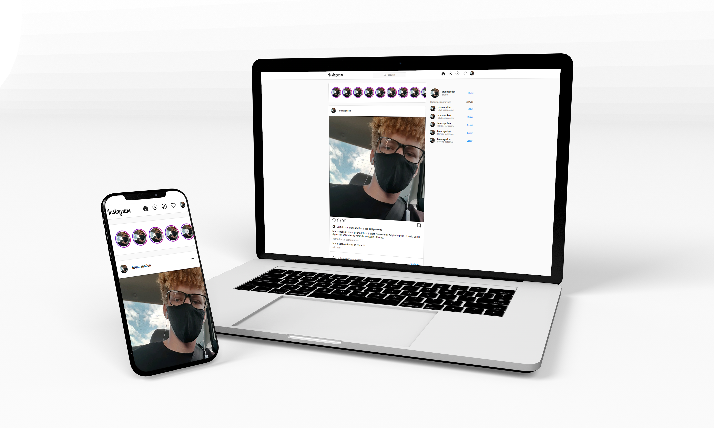

<h1 align="center">
  Clone UI do instagram
</h1>

  <a href="#-tecnologias">Tecnologias</a>&nbsp;&nbsp;&nbsp;|&nbsp;&nbsp;&nbsp;
  <a href="#-projeto">Projeto</a>&nbsp;&nbsp;&nbsp;|&nbsp;&nbsp;&nbsp;
  <a href="#-observações">Observações</a>

 

  

## ✨ Tecnologias

Esse projeto foi desenvolvido com as seguintes tecnologias:

- [React](https://reactjs.org)
- [Javascprit](https://developer.mozilla.org/pt-BR/docs/Web/JavaScript)

## 💻 Projeto

Esse projeto é apenas uma aplicação de conhecimentos adquiridos em meus estudos, com o único intuito de testar meu aprendizado!

## 👀 Observações

- Para instalar todas as dependências utilizadas no projeto basta rodar o comando `yarn`
- O servidor pode ser iniciado com `yarn start`, onde se tem acesso pelo [`localhost:3000`](http://localhost:3000) no navegador.

---

- Projeto feito apenas para teste de conhecimento 💻💖🚀
- Todos direitos reservados ao NSTAGRAM DO FACEBOOK
